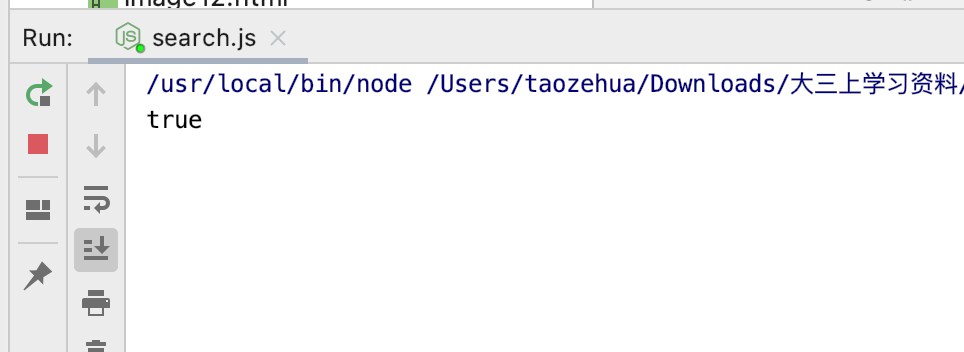

**使用nodejs+axios+html+css+javascript技术实现简单的登录和注册页面**

# 1.简介

- 使用node.js作为项目的后端
- 使用普通的html+css+javascript作为项目的前端
- 使用axios负责进行前后端的请求和交互
- 使用mysql作为项目的数据库存储数据。(数据库文件见代码目录下的UserData.sql)

使用上述的四个技术完成登录、注册功能（包含验证码、密码强度验证）。

# 2.环境搭建

## 2.1 安装node.js

在mac下安装node.js的命令如下：

```bash
brew install node
```

当然也可以去nodejs的官网下载

## 2.2 下载axios

- 去axios的官网下载axios，这里对axios的使用很简单，只需要下载axios.min.js即可。

- 下载完成后放在项目目录下的js目录下

- 使用时在html中引入即可

  ```html
  <script src="js/axios.min.js"></script>
  ```

## 2.3 安装Express框架

Express 是一个简洁而灵活的 node.js Web应用框架, 提供了一系列强大特性帮助创建各种 Web 应用，和丰富的 HTTP 工具。使用 Express 可以快速地搭建一个完整功能的网站。

- 在项目目录下运行如下命令即可安装：

  ```bash
  cnpm install express --save
  ```

##  2.4 安装cors模块

cors模块可以用来解决前后端的跨域问题，安装命令如下：

```bash
cnpm install cors --save
```

cors的具体配置如下，这里的63342端口是前端项目运行的端口（使用时对应替换为自己的就可以了）

```javascript
var cors = require('cors');
app.use(cors({
    origin:['http://localhost:63342'],
    methods:['GET','POST'],
    alloweHeaders:['Conten-Type', 'Authorization']
}));
```

## 2.5 mysql配置

安装和配置mysql后在mysql下创建UserData数据库，在该数据库下创建表（这里使用Navicat Premium来可视化创建）。表的内容形式如下：（包含username和password两个属性，其中username是键）


# 3. 代码介绍

## 3.1 登录页面

1. 主要的html代码如下，包含用户名、密码和验证码输入框，登录和注册按钮。点击验证码框会调用checkCode()方法随机生成新的验证码，点击登录按钮会调用check()方法检查用户名、密码和验证码的正确性。

   ```html
   <div class="item">
       <input type="text" value="" placeholder="请输入用户名" id="username">
   </div>
   <div class="item">
       <input type="password" value="" placeholder="请输入密码" id="password">
   </div>
   <div class="item">
       <input type="text" value="" placeholder="请输入验证码" id="text">
       <canvas id="canvas" width="100" height="40" onclick="checkCode()"
               style="border: 2px solid black;background: aqua;"></canvas>
   </div>
   <button value="Login" class="log" onclick="check()">
       登录
   </button>
   <div class="font">
      没有账户？
      <button value="Register" class="register">
        	<a href="Register.html" class="href">注册</a>
      </button>
   </div>
   ```

2. 验证码生成的过程如下：

   ```javascript
   function draw(check_code) {
       const canvas = document.getElementById("canvas");
       var ctx = canvas.getContext("2d");
       canvas.width = document.getElementById('canvas').clientWidth;
       canvas.height = document.getElementById('canvas').clientHeight;
       var sCode = "A,B,C,E,F,G,H,J,K,L,M,N,P,Q,R,S,T,W,X,Y,Z,1,2,3,4,5,6,7,8,9,0,q,w,e,r,t,y,u,i,o,p,a,s,d,f,g,h,j,k,l,z,x,c,v,b,n,m";
       var aCode = sCode.split(",");
       var aLength = aCode.length;//获取到数组的长度
   
       for (var i = 0; i <= 3; i++) {
           var j = Math.floor(Math.random() * aLength);//获取到随机的索引值
           var deg = Math.random() * 30 * Math.PI / 180;//产生0~30之间的随机弧度
           var txt = aCode[j];//得到随机的一个内容
           check_code[i] = txt;
           var x = 10 + i * 20;//文字在canvas上的x坐标
           var y = 20 + Math.random() * 8;//文字在canvas上的y坐标
           ctx.font = "bold 22px 微软雅黑";
   
           ctx.translate(x, y);
           ctx.rotate(deg);
           ctx.fillStyle = "#0000ff";
           ctx.fillText(txt, 0, 0);
           ctx.rotate(-deg);
           ctx.translate(-x, -y);
       }
   }
   ```

3. 使用check方法进行验证输入的验证码、用户名以及密码的正确性

   - 根据html元素的id获得用户输入的验证码、用户名以及密码

     ```javascript
     var username = document.getElementById("username").value;
     var password = document.getElementById("password").value;
     var val = document.getElementById("text").value;
     ```

   - 判断用户输入的验证码的正确性，若不正确或者未输入则做出相应的提示。若验证码正确则使用axios请求nodejs搭建的后端根据用户输入的用户名获得对应的密码，与用户输入的密码进行对比，判断密码的正确性。密码正确则跳入图片库页面。（这里后端的地址为 http://127.0.0.1:8081/login ，因此axios的get方法的第一个参数为 http://127.0.0.1:8081/login）

     ```javascript
     axios.get('http://127.0.0.1:8081/login', {
         params: {
             username: username
         }
     }).then((res) => {
         // 密码正确
         //console.log(res);
         if (res.data.length!==0) {
             if (res.data[0].password === password) {
                 window.location.href = "imageDir.html";
             } else {
                 alert('密码错误！');
             }
         } else {
             alert('用户名不存在！');
         }
     });
     ```

4. nodejs（对应于static目录下的search.js）的实现如下：

   - 解决跨域问题（在我们的项目启动运行时，nodejs对应的后端运行在127.0.0.1:8081端口上，前端运行在localhost:63342端口上），使用先前引入的cors模块解决跨域问题。

     ```javascript
     var express = require('express');
     var fs = require("fs");
     var app = express();
     
     // 解决跨域问题
     var cors = require('cors');
     app.use(cors({
         origin:['http://localhost:63342'],
         methods:['GET','POST'],
         alloweHeaders:['Conten-Type', 'Authorization']
     }));
     
     
     app.use(express.static(__dirname));
     ```

   - 链接数据库，对数据库做相应的操作。get方法的第一个参数必须与axios请求的地址名字一样（这里对应的都是/login）。
     使用`req.query.username`可以获得前端传过来的username参数，存在`response`变量中，使用`SELECT password FROM user WHERE username=response.username`查询语句即可根据用户名获得对应的密码。最后使用`res.send(result);`将查询到的结果返回到前端做进一步的处理和判断。

     ```javascript
     app.get('/login', function (req, res) {
         // 连接数据库
         var mysql = require('mysql');
         var connection = mysql.createConnection({
             host: 'localhost',
             user: 'root',
           // password替换为本地数据库的密码
             password: 'xxxxxx',
             port: '3306',
             database: 'UserData'
         });
     
         connection.connect();
     
         // 获得前端传递过来的参数
         var response = {
             "username":req.query.username
         };
         // 根据用户名查询对应的密码，进行登录验证
         var sql = "SELECT password FROM user WHERE username=(?)";
         var  sqlParam = [response.username];
         // 根据用户名查询对应密码进行验证
         connection.query(sql,sqlParam, function (err, result) {
            if (err) {
                 console.log('[SELECT ERROR] - ', err.message);
                 res.send(err);
                 return;
             }
             console.log(result);
             // 查询到的结果返回到前端
             res.send(result);
         });
     
     
         connection.end();
     });
     ```

   - 使用如下代码监听8081端口

     ```javascript
     var server = app.listen(8081, function () {
     
         var host = server.address().address;
         var port = server.address().port;
     });
     ```

## 3.2 注册页面

1. 主要的html代码如下，包含用户名、密码输入框以及和注册按钮。在输入密码时，会根据用户输入的密码判断密码的强弱等级，对用户作出提醒。点击注册按钮会调用register()方法向数据库添加用户的用户名以及密码数据。

   ```javascript
   <div class="item">
       <input type="text" name="username" value="" placeholder="用户名" id="username">
   </div>
   <div class="item">
       <input type="text" name="password" value="" placeholder="密码" id="password"
              onKeyUp="checkPassword(this.value)" onblur="checkPassword(this.value)">
   </div>
   <meter value="0" id="meter" style="width: 220px;"></meter>
   <div class="font">
       <button value="Register" class="register" onclick="register()">
           注册
       </button>
   </div>
   ```

2. `checkPassword()`方法使用用户输入的密码包含的字符的种类的多少来判断密码的强弱等级，并对用户做出提示。实现如下：

   ```javascript
   if (password.length === 0) {
       document.getElementById("meter").value = 0;
       return;
   }
   if (password.length <= 4) {
       document.getElementById("meter").value = 0.25;
       return;
   }
   // 判断密码包含的种类
   var number = 0; // 0不包含数字，1包含数字
   var capsCh = 0; // 0不包含大写字母，1包含大写字母
   var ch = 0; // 0不包含小写字母，1包含小写字母
   var special = 0; // 0不包含特殊字符，1包含特殊字符
   for (i = 0; i < password.length; i++) {
       if (password.charCodeAt(i) >= 48 && password.charCodeAt(i) <= 57) {
           //数字
           if (number === 0) number = 1;
           else continue;
       } else if (password.charCodeAt(i) >= 65 && password.charCodeAt(i) <= 90) {
           //大写字母
           if (capsCh === 0) capsCh = 1;
           else continue;
       } else if (password.charCodeAt(i) >= 97 && password.charCodeAt(i) <= 122) {
           //小写字母
           if (ch === 0) ch = 1;
       } else {
           if (special === 0) special = 1;
       }
   }
   var types = number + capsCh + ch + special; // 密码包含几种类型的字符
   // 按照种类数分别设置密码强度
   switch (types) {
       case 0:
           document.getElementById("meter").value = 0;
       case 1:
           document.getElementById("meter").value = 0.25;
           break;
       case 2:
           document.getElementById("meter").value = 0.5;
           break;
       case 3:
           document.getElementById("meter").value = 0.75;
           break;
       default:
           document.getElementById("meter").value = 1;
   }
   ```

3. `register()`方法在用户点击注册按钮时会被触发，它会使用axios方法向数据库添加用户的用户名以及密码数据。

   - 使用`getElementById()`方法获得用户输入的用户名和密码

     ```javascript
     var username = document.getElementById("username").value;
     var password = document.getElementById("password").value;
     ```

   - 向后端的/signUp发送请求，带上要传递的参数。数据成功插入数据库则跳转到登录页面进行登录。

     ```javascript
     axios.get('http://127.0.0.1:8081/signUp', {
         params: {
             // 带上参数
             username: username,
             password: password
         }
     }).then((res) => {
         // console.log(res);
         // 注册成功跳转
         window.location.href = "login.html";
     });
     ```

4. 对应的nodejs（对应于static目录下的add.js）实现如下：

   - 解决跨域问题（在我们的项目启动运行时，nodejs对应的后端运行在127.0.0.1:8081端口上，前端运行在localhost:63342端口上），使用先前引入的cors模块解决跨域问题。

     ```javascript
     var express = require('express');
     var fs = require("fs");
     var app = express();
     
     app.use(express.static(__dirname));
     
     // 解决跨域问题
     var cors = require('cors');
     app.use(cors({
         // 63342是前端的端口地址
         origin:['http://localhost:63342'],
         methods:['GET','POST'],
         alloweHeaders:['Conten-Type', 'Authorization']
     }));
     ```

   - 链接数据库，对数据库做相应的操作。get方法的第一个参数必须与axios请求的地址名字一样（这里对应的都是/signUp）。
     使用`req.query.username、req.query.password`可以获得前端传过来的username和password参数，存在`response`变量中，使用`INSERT INTO user(username,password) VALUES(response.username, response.password)`插入语句即可将用户名和密码插入到数据库中。最后使用`res.send(result);`将插入的结果返回到前端做进一步的处理和判断。

     ```javascript
     app.get('/signUp', function (req, res) {
     
         // 连接数据库
         var mysql = require('mysql');
         var connection = mysql.createConnection({
             host: 'localhost',
             user: 'root',
             password: 'x x x x x',
             port: '3306',
             database: 'UserData'
         });
     
         connection.connect();
     
         // 获得前端传过来的参数
         var response = {
             "username":req.query.username,
             "password":req.query.password
         };
     
         // 插入新的用户名和密码数据
         var  addSql = 'INSERT INTO user(username,password) VALUES(?,?)';
         var  addSqlParams = [response.username, response.password];
         //增
         connection.query(addSql,addSqlParams,function (err, result) {
             if(err){
                 console.log('[INSERT ERROR] - ',err.message);
                 return;
             }
     
             console.log(result);
             // 将结果返回到前端
             res.send(result);
         });
     
     
         connection.end();
     });
     ```

   - 使用如下代码监听8081端口

     ```javascript
     var server = app.listen(8081, function () {
     
         var host = server.address().address;
         var port = server.address().port;
     
     });
     ```

# 3. 项目运行

1. 进入add.js所在的目录下后使用如下命令启动nodejs搭建的后端add.js

   ```bash
   node add.js
   ```

2. 访问注册页面进行注册，输入如下的用户名和密码（可以看出密码强度已经到达最高），点击注册按钮

   

   此时页面跳转进入登录页面，并且数据库中已经出现了注册时输入的用户名和密码，注册成功。

   另外控制台输出的响应信息代表数据库插入操作成功。

   

3. 关闭add.js对应的后端服务，进入search.js所在的目录下后使用如下命令启动nodejs搭建的后端search.js

   ```bash
   node search.js
   ```

4. 访问登录页面，使用刚刚注册的用户名和密码进行登录。登录成功，进入了图片库页面。
   此时控制台输出了用户名对应的密码，可见根据用户名查找对应的密码的数据库操作成功。
   
   若输入错误的密码或者用户名不存在，会做出如下提示：
   

   

